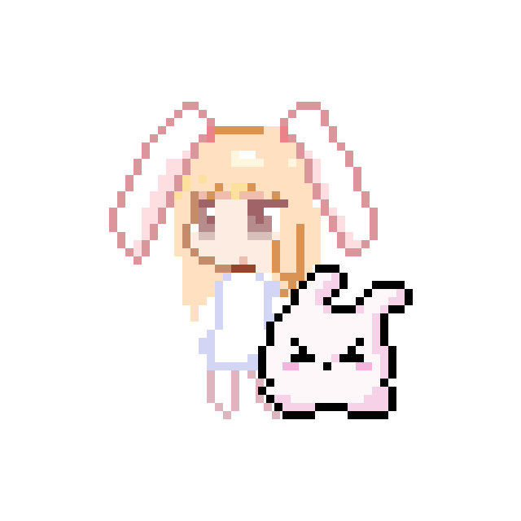

# Desktop Bunny



模仿 Rabi-Ribi 风格画的兔兔

## Feature

- 在底部任务栏随机游走
- 检测屏幕上可以支撑的平台并跳上去
- 点击静止状态的 Bunny 使其跳跃
- 读取屏幕内容并吐槽（需要连接云端模型）
- 添加/移除兔兔（1-5只）
- 点击下蹲状态的 Bunny 可以使其变身（需要 50 以上饱食度）
- 加了饱食度（0 - 100）每 216 秒减少一点，可以拖动文件至 Bunny 来喂食恢复 Bunny 的饱食度（会销毁文件，不进入回收站）
- 支持与 Bunny 交互（需要连接云端模型），保存长期记忆（需要连接本地 Ollama bge-m3），记忆文件存储在本地
- 目前调用模型是写死的

## Quick Start

### 替换 api_key

目前云端模型通过 silicon 调用，需要修改 tools/constants.py 下的 SILICONFLOW_API_KEY 为自己的 api_key

### 安装 Ollama 模型

```bash
ollama pull bge-m3
```

### 安装 Python 3.13.13 & 依赖 & 打包

```bash
pip install -r requirements.txt
```
```bash
pyinstaller --name Bunny --onefile --windowed --icon=assets/icon.png --add-data "assets\*;assets" --add-data "components\*.py;components" main.py
```

运行 dist 目录下的 Bunny.exe

## 连接模型

目前调用 silicon 上的 Qwen/Qwen3.5-397B-A17B 模型交互，这些配置可以在 tools/constants.py 里改，本地的 Ollama bge-m3 进行向量化存储记忆，需要补充 silicon 的 api_key 并在 Ollama 安装模型并开放接口，Bunny 会自动尝试连接
